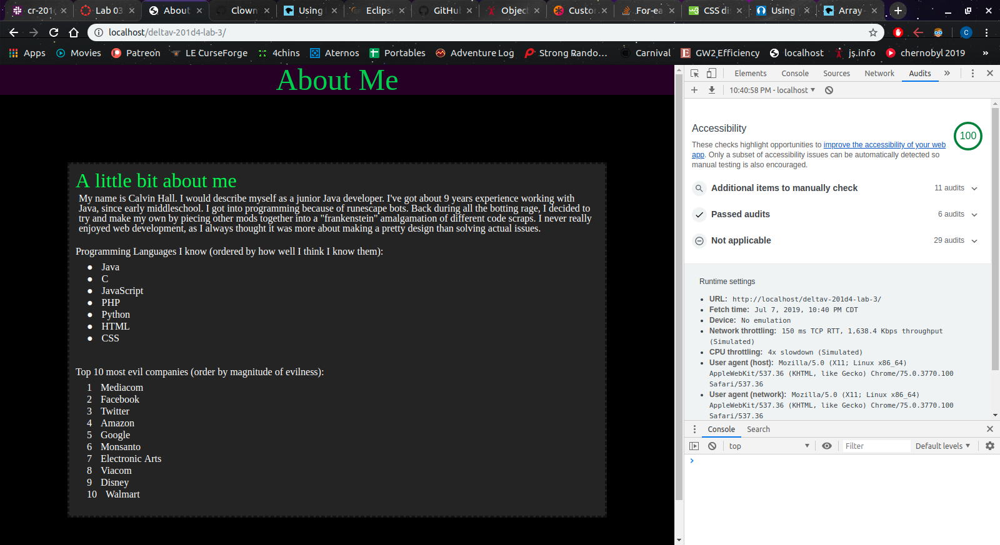

# deltav-201d4-lab-3
<h1 id="lab-3">Lab 3</h1>

<h3 id="author-studentgroup-name">Author: Calvin</h3>

<h2 id="project-name">About Me (Part 2)</h2>

Create a website which lists some about me information, and has a y/n quiz about me on it. The project must at least meet these requirements:

<ul>
  <li>HTML, CSS, and JavaScript must be cleanly written with correct indentation and syntax. Look at examples online and in your textbook. Note that your JS must pass the rules in the linter that we installed.</li>
  <li>Your JS file must contain a ‘use strict’ declaration at the top. Always.</li>
  <li>Design a guessing game about you that involves FIVE yes/no questions. Be creative and fun and whimsical. Or not. It’s up to you! It’s your project!</li>
  <li>The questions in the guessing game must require a mix of yes/no answers, and user input must accept either y/n or yes/no responses, with either .toUpperCase() or .toLowerCase() used to validate the user input and accommodate users entering all-caps Y/N or YES/NO answers, too.</li>
  <li>Useful and descriptive console.log() messages in the JS are well written and correctly displaying to the browser console for each question of the guessing game.</li>
  <li>Use CSS to style your page as you see fit, to the level of abilities in CSS that you currently have.</li>
  <li>Follow the Add, Commit, Push process. It should be evident in GitHub that commits are made regularly, and with good commit messages that explain the WHY of the commit.</li>
</ul>

<h3 id="reflections-and-comments">Reflections and Comments</h3>

For the most part went swimmingly. Although, I feel that the base requirements don't require you to add many HTML elements, which in turn means there's not a whole lot of stylization you can do with the CSS portion.

<h3 id="accessibility-picture">Google Accessibility Results</h3>

